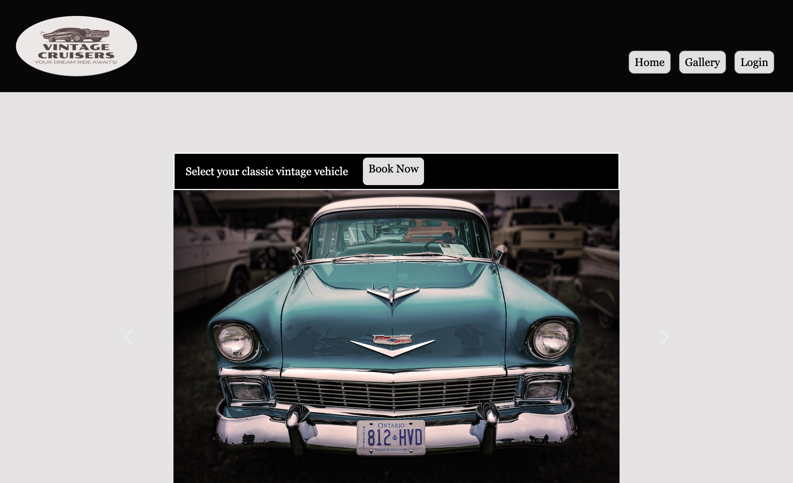
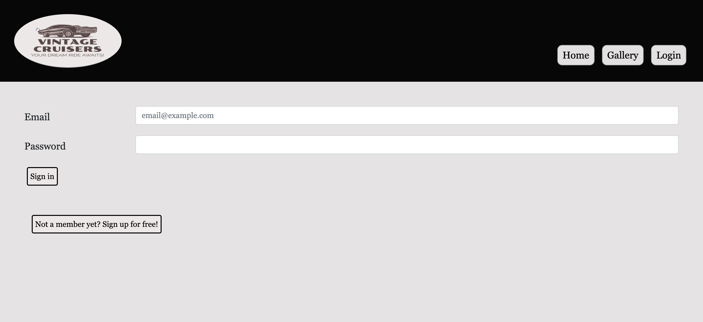
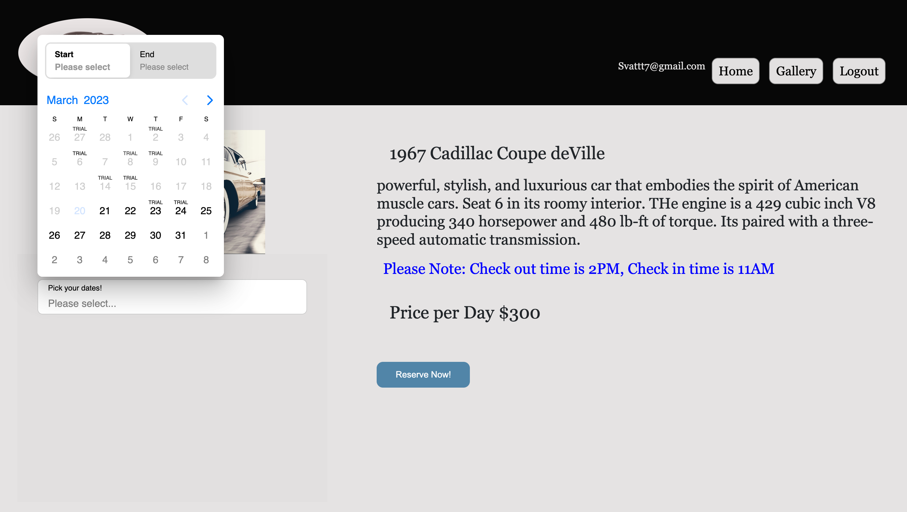
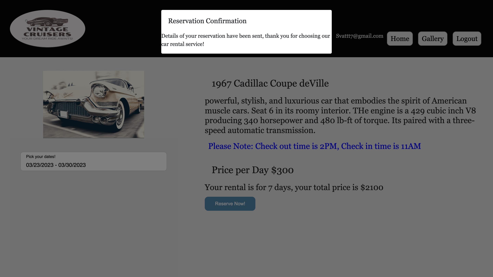

# E-commerce Vintage Cruisers

E-commerce Vintage Cruisers is a website that offers vintage car rental services to customers who are looking to add a touch of style and elegance to their special events. Whether it's a wedding, prom night, or a photoshoot, Vintage Cruisers has a collection of classic cars that are sure to make any occasion unforgettable.

  * [Installation](#install)
  * [Usage](#usage)
  * Visit deployed Heroku app [here.](https:/herokuapp.com/)


## User Story

Booking a vintage car on our platform is simple and straightforward. Just browse our selection of available cars, choose the model that suits your needs, and book it for your desired rental period. We offer flexible rental options, daily, and weekly rentals, so you can enjoy your vintage ride for as long as you need.


## Installion

Clone project.
Run the following line of code in your terminal to install all the needed packages: 
```
npm i
```


## Usage

Once all the packages have been installed build your DataBase. You can use Mysql workbench to create your DB or run command line:
```
mysql -u root -p
```
and create your DB there. Once DB has been created run in your terminal:
```
npm run seed
```
to seed your DB. Once your DB is completed go to url:
```
http://localhost:3001
```


## Built With

- Handlebars express
- Bootstrap
- JavaScript
- Sequelize
- Node.js
  - dotenv
  - express
  - express-sessions
  - bcrypt
  - mysql2
  - sequelize
  - nodemailer


## Screen shots






 
## License


Source link for [MIT](https://opensource.org/licenses/MIT)

## Contributors
- Terianne Phillips
- Karin Sundin
- Alexia Fast
- Sviatoslav Zakharuk
- Felix Mandungu

## Tests

There are currently no tests for this application.  

## Contact

- phillips.terianne@gmail.com
- sundinkarin83@gmail.com
- alexiafastproduction@gmail.com
- Svattt7@gmail.com
- lixman_d@outlook.com


